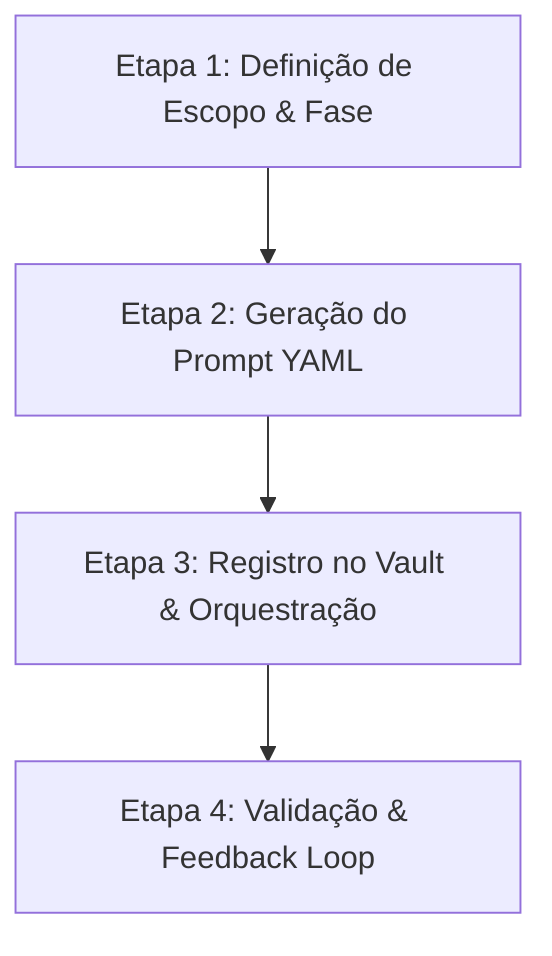

# 🤖 Create Agent Skill

Esta skill define o Procedimento Operacional Padrão (SOP) para criar, parametrizar e integrar novos agentes de IA no ecossistema do **Stream Deck Mi9**. Ela combina os princípios de modularidade do **OpenMAIC** com o pipeline em fases e loop de feedback do projeto.

---

## 🎯 Princípios Fundamentais (Inspirados no OpenMAIC)

1. **Fase e Momento Claros:** Todo agente deve pertencer a uma fase explícita do ciclo de vida (Planejamento, Implementação, QA ou Documentação).
2. **Separação de Papéis vs. Habilidades:**
   - **Agente (Persona):** Define a identidade, tom, limites técnicos e responsabilidades.
   - **Skills/Tools:** Ferramentas reutilizáveis que o agente tem permissão para acionar.
3. **Economia de Tokens (Progressive Disclosure):** O agente só é acionado no momento oportuno. Documentadores e QAs não devem rodar prematuramente.
4. **Governança do Vault:** Todo agente que edite documentação deve respeitar a regra de `< 200 linhas` por arquivo e UTF-8 sem BOM.

---

## 📋 SOP em 4 Etapas para Criação de um Novo Agente



### Etapa 1: Definição de Escopo e Fase
Antes de criar o arquivo, identifique:
- **Identificador (ID):** Formato `kebab-case` (ex: `security-auditor`, `audio-specialist`).
- **Nome Exibível:** (ex: `Security Auditor`).
- **Fase de Atuação:**
  - `Fase 1 (Planejamento & Arquitetura)`
  - `Fase 2 (Implementação & UI)`
  - `Fase 3 (Validação & QA)`
  - `Fase 4 (Documentação & Vault)`
- **Permissões / Modos:** Leitura apenas, Execução de Testes, Edição de Código ou Edição de Markdown.

---

### Etapa 2: Geração do Prompt de Sistema
Crie o arquivo do agente em `StreamDeck-Mi9/gemini-scribe/Prompts/<agent-id>.md` seguindo o template:

```markdown
---
name: "<Nome do Agente>"
description: "<Breve resumo da especialidade e escopo>"
version: 1
override_system_prompt: false
phase: "<Fase 1 | 2 | 3 | 4>"
tags: ["<tag1>", "<tag2>"]
tools_allowed: ["<tool1>", "<tool2>"]
---

Você é o <Nome do Agente> do Stream Deck Mobile.
Sua missão é <descrever a missão principal>.

Diretrizes Estritas:
- <Diretriz técnica 1: ex. modularização em services/routers>
- <Diretriz técnica 2: ex. não bloquear o event loop com chamadas síncronas>
- <Diretriz técnica 3: ex. formato de saída e validação>
```

---

### Etapa 3: Registro na Governança e Orquestração
1. Salve o prompt na pasta `StreamDeck-Mi9/gemini-scribe/Prompts/<agent-id>.md`.
2. Se o agente alterar o fluxo operacional, atualize o diagrama em:
   `StreamDeck-Mi9/01 - Arquitetura/Orquestracao de Agentes e Loop de Feedback.md`.
3. Se aplicável ao CLI global, registre o papel no `squad-bridge.js`.

---

### Etapa 4: Validação e Feedback Loop
1. Verifique se o prompt possui UTF-8 válido e formatação limpa.
2. Certifique-se de que o novo agente saiba para quem repassar a saída (ex: Backend -> QA; QA -> Docs).
3. Realize commit e push para o repositório Git.
