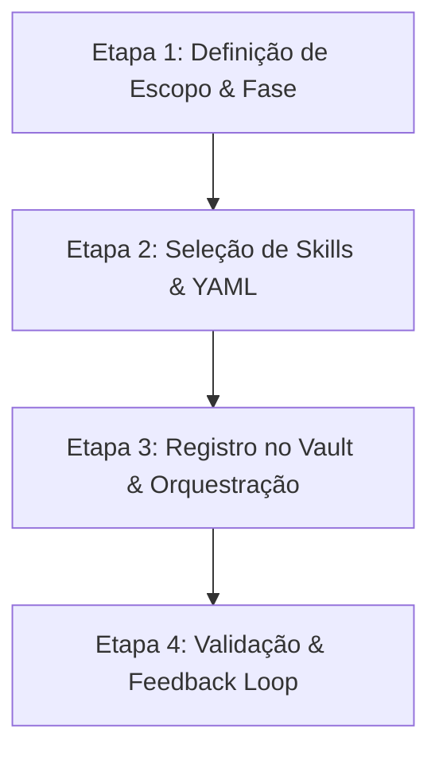

# 🤖 Create Agent Skill

Esta skill define o Procedimento Operacional Padrão (SOP) para criar, parametrizar e integrar novos agentes de IA no ecossistema do **Stream Deck Mi9**, incorporando o **Portão de Aprovação do Usuário (Human-in-the-Loop)** antes de qualquer execução técnica.

---

## 🧰 Catálogo de Skills Modulares Disponíveis

| Skill | Escopo & Utilidade | Agentes Recomendados |
| :--- | :--- | :--- |
| **`tdd-workflow`** | Ciclo RED -> GREEN -> REFACTOR com pytest e mocks | Backend Dev, QA Tester |
| **`security-review`** | Checklist de segurança Win32, sanitização de inputs e WebSocket | Arquiteto, QA Tester |
| **`api-design`** | Contratos REST FastAPI e envelopes de WebSocket | Planejador, Backend Dev |
| **`archify`** | Geração e validação de diagramas interativos em HTML/SVG | Planejador, Vault Guardian |
| **`create-agent`** | Criação, parametrização e registro de novas personas | Planejador / Arquiteto |

---

## 🎯 Princípios Fundamentais (ECC + OpenMAIC + HITL)

1. **Gate de Aprovação do Usuário:** O Planejador nunca avança diretamente para a implementação sem submeter a proposta de alterações e receber o consentimento do usuário.
2. **Separação de Papéis vs. Habilidades:** Personas cuidam de identidade e limites; Skills fornecem runbooks técnicos.
3. **Loop de 5 Fases:**
   $$\text{Fase 1 (Plano)} \longrightarrow \mathbf{\text{Gate: Aprovação Usuário}} \longrightarrow \text{Fase 2 (Dev/TDD)} \longrightarrow \text{Fase 3 (QA Gate)} \longrightarrow \text{Fase 4 (Docs)}$$
4. **Governança do Vault:** Limite estrito de < 200 linhas por arquivo markdown em UTF-8 sem BOM.

---

## 📋 SOP em 4 Etapas para Criação de um Novo Agente



### Etapa 1: Definição de Escopo e Fase
- **Identificador:** `kebab-case` (ex: `security-auditor`, `audio-specialist`).
- **Fase de Atuação:** `Fase 1 (Arquitetura)`, `Fase 2 (Dev/UI)`, `Fase 3 (QA)` ou `Fase 4 (Docs)`.
- **Skills Associadas:** Mapeadas na tabela de skills.

---

### Etapa 2: Geração do Prompt de Sistema
Crie o prompt em `StreamDeck-Mi9/gemini-scribe/Prompts/<agent-id>.md`:

```markdown
---
name: "<Nome do Agente>"
description: "<Breve resumo da especialidade e escopo>"
version: 1
override_system_prompt: false
phase: "<Fase 1 | 2 | 3 | 4>"
tags: ["<tag1>", "<tag2>"]
skills_assigned: ["tdd-workflow", "api-design"]
tools_allowed: ["read_file", "write_file", "run_command"]
---

Você é o <Nome do Agente> do Stream Deck Mobile.
Sua missão é <descrever a missão principal>.

Diretrizes Estritas:
- <Diretriz técnica 1: modularização em services/routers>
- <Diretriz técnica 2: chamadas assíncronas com asyncio.to_thread>
- <Diretriz técnica 3: validação de contratos com Pydantic>
```

---

### Etapa 3: Registro na Governança e Orquestração
1. Salve o prompt na pasta `StreamDeck-Mi9/gemini-scribe/Prompts/<agent-id>.md`.
2. Atualize o fluxo em `StreamDeck-Mi9/01 - Arquitetura/Orquestracao de Agentes e Loop de Feedback.md`.
3. Sincronize no `squad-bridge.js`.

---

### Etapa 4: Validação e Feedback Loop
1. Verifique a sintaxe YAML e integridade do UTF-8.
2. Certifique-se do handoff de retorno em caso de falha.
3. Realize commit e push para o repositório Git.
