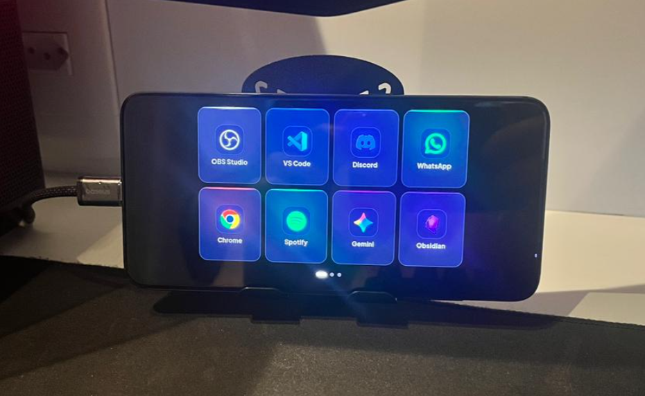
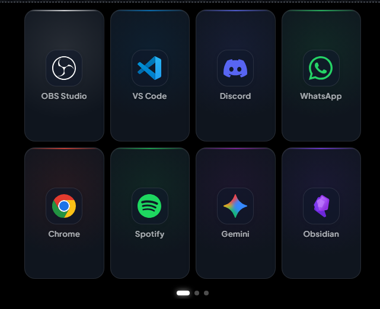
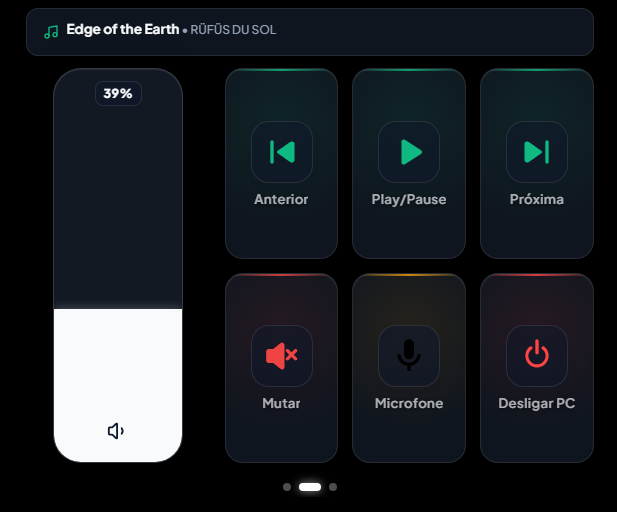

# 📱 Stream Deck Mobile - App Launcher para Windows

O projeto **Stream Deck Mobile** nasceu com um propósito ecológico e prático: **dar um novo destino e utilidade para um smartphone antigo que já estava descartado**. Aproveitando o display AMOLED de um Xiaomi Mi 9, transformamos um aparelho sem uso em um controlador de mídia e lançador de aplicativos remoto, premium e de baixa latência para o Windows, operando inteiramente via rede local (Wi-Fi).

Para gerenciar a complexidade e estruturar todas as etapas do desenvolvimento, utilizamos o **Obsidian como nosso "Segundo Cérebro"**. Todo o planejamento, backlog de tarefas, problemas resolvidos e decisões de arquitetura foram armazenados e organizados em um *Vault* dedicado, o que garantiu uma evolução limpa e escalável para o projeto.

<div align="center">
  
  
  
  
  
  
  
  
</div>
<br>

<!-- Espaço para a foto do projeto -->






Abaixo, apresentamos um resumo **extremamente detalhado** da arquitetura, regras de negócio e implementação final do sistema.

---

## 🏗 Arquitetura do Sistema

O projeto é estruturado em uma arquitetura cliente-servidor leve em tempo real via **WebSockets**:

1. **Backend (Python / FastAPI):** Responsável por escutar os comandos na rede local, validar a segurança da conexão, invocar executáveis do Windows de forma não-bloqueante, controlar áudio/microfone nativo e anunciar o serviço na rede via mDNS (`streamdeck.local`). Também é o responsável por servir os arquivos estáticos do frontend.
2. **Frontend (React / Vite PWA):** Responsável por exibir a interface gráfica moderna (Glassmorphism / OLED Blackout), controle de volume dinâmico estilo iOS, banner de reprodução de mídia em tempo real e atalhos rápidos.

---

## 🔙 Backend: Especificações e Regras Estritas

Localizado na pasta `backend/`, o servidor foi projetado para ser leve, rápido e não-bloqueante.

### Tecnologias Utilizadas
* **FastAPI:** Framework web assíncrono de alta performance.
* **Uvicorn:** Servidor ASGI para rodar a aplicação.
* **WebSockets:** Protocolo de comunicação bidirecional em tempo real.
* **Pycaw / Comtypes:** Controle do Windows Core Audio (Volume absoluto e Microfone).
* **WinRT (`winrt-Windows.Media.Control`):** Captura em tempo real dos metadados de reprodução (Spotify, YouTube, navegadores).
* **Zeroconf (mDNS):** Descoberta automática de IP na rede local via domínio `streamdeck.local`.
* **Python-dotenv:** Gerenciamento seguro de variáveis de ambiente.

### Regras de Negócio Implementadas
* **Padrão "Fire and Forget" (Não-bloqueante):** 
  * O backend apenas dá o gatilho inicial para abrir o aplicativo e responde imediatamente. 
  * Utiliza `os.startfile()` para atalhos e links, e `subprocess.Popen()` com flags apropriadas (`CREATE_NEW_PROCESS_GROUP` e `STARTF_USESHOWWINDOW`) para garantir que os aplicativos abram com suas janelas visíveis sem travar a thread assíncrona do FastAPI.
* **Handshake de Segurança (Token):**
  * O servidor possui um endpoint em `/ws`. 
  * Ao receber uma conexão, aguarda a primeira mensagem: `{"auth_token": "SEU_TOKEN"}`.
  * Se o token estiver incorreto, a conexão é abortada imediatamente com código **WebSocket 1008 (Policy Violation)**.
* **Mapeamento de Caminhos (`apps_config.py`):**
  * Mapeamento com `os.path.expandvars()` para ler variáveis do Windows (`%LOCALAPPDATA%`, `%PROGRAMFILES%`, `%APPDATA%`), funcionando para qualquer usuário.

---

## 🎨 Frontend: Especificações e Regras Estritas

Localizado na pasta `frontend/`, a aplicação foi estruturada como um **Progressive Web App (PWA)** focado em fluidez e imersão.

### Tecnologias Utilizadas
* **React + Vite:** Construção modular e compilação ultra-rápida.
* **Swiper.js:** Paginação tátil em blocos de aplicativos (chunks).
* **Lucide-react:** Ícones vetoriais modernos.
* **NoSleep.js / Wake Lock API:** Prevenção contra desligamento da tela do celular.

### Regras de Negócio Implementadas
* **Modo PWA e Tela Cheia (Imersão):**
  * Configurado com `display: fullscreen` no `manifest.json` e bloqueio de zoom no `index.html`.
  * Tema `#000000` (preto absoluto) para economia de energia em telas AMOLED.
* **Resiliência e Auto-Reconexão:**
  * O hook customizado `useWebSocket.js` gerencia os estados da conexão (`CONNECTED`, `AUTHENTICATED`, `RECONNECTING`, `ERROR`).
  * Loop automático de reconexão a cada **3 segundos** em caso de oscilação do Wi-Fi.
* **Now Playing & Controles de Mídia:**
  * Componente `NowPlaying.jsx` com suporte a título, artista e scroll suave de texto longo.
  * `VolumeSlider.jsx` vertical inspirado no iOS Control Center, com feedback tátil de vibração (`navigator.vibrate`).
* **Design Responsivo (Portrait & Landscape):**
  * Ajuste automático para modo horizontal mantendo a proporção quadrada perfeita dos botões.

---

## 📂 Estrutura de Diretórios Final

```text
Stream Deck/
├── backend/
│   ├── venv/                     # Ambiente virtual Python
│   ├── .env                      # Variáveis locais (AUTH_TOKEN, HOST, PORT)
│   ├── .env.example              # Exemplo de configuração
│   ├── requirements.txt          # Dependências Python
│   ├── apps_config.py            # Mapeamento de atalhos e executáveis
│   ├── audio_service.py          # Controle de volume e microfone (pycaw)
│   ├── main.py                   # Servidor FastAPI, WebSockets e mDNS
│   └── test_backend.py           # Testes de handshake e comandos
├── frontend/
│   ├── public/
│   │   ├── favicon.svg
│   │   ├── icon.svg              # Ícone do PWA
│   │   └── manifest.json         # Configurações PWA (fullscreen, theme-color)
│   ├── src/
│   │   ├── assets/               # Ícones vetoriais dos aplicativos
│   │   ├── components/           # DeckButton, VolumeSlider, NowPlaying, Modais
│   │   ├── config/               # apps.js (catálogo) e constants.js
│   │   ├── hooks/                # useWebSocket e useWakeLock
│   │   ├── App.jsx               # Entrypoint da interface
│   │   └── index.css             # Estilos globais e tema OLED
│   ├── index.html                # Viewport e meta tags mobile
│   ├── package.json
│   └── vite.config.js
├── StreamDeck-Mi9/               # Memorial descritivo completo (Obsidian Vault)
├── iniciar_streamdeck.vbs        # Script de inicialização silenciosa em 1 clique
├── setup_autostart.ps1           # Script para iniciar com o Windows
├── .gitignore                    # Regras de exclusão do Git
└── README.md                     # Documentação oficial
```

---

## 🚀 Como Executar o Projeto

Com a arquitetura unificada (V6), o backend Python hospeda o frontend pré-compilado e o WebSocket simultaneamente na mesma porta.

### 1. Inicialização Rápida (1 Clique)
Basta dar dois cliques no arquivo:
```text
iniciar_streamdeck.vbs
```
Ele iniciará o servidor FastAPI silenciosamente em segundo plano na porta **8000** e registrará o mDNS na rede local.

### 2. Inicialização Manual via Terminal
Se preferir rodar pelo terminal para visualizar os logs:
```powershell
cd "backend"
.\venv\Scripts\python.exe -m uvicorn main:app --host 0.0.0.0 --port 8000
```

### 3. Acessando pelo Smartphone (Xiaomi Mi 9)
1. Conecte o celular na **mesma rede Wi-Fi** do computador.
2. Abra o navegador no smartphone e acesse:
   * **Via mDNS (Recomendado):** `http://streamdeck.local:8000`
   * **Ou via IP Local:** `http://<SEU_IP_LOCAL>:8000` (ex: `http://192.168.15.16:8000`)
3. No navegador (Google Chrome), toque nos três pontinhos e selecione **"Adicionar à tela inicial"** ou **"Instalar Aplicativo"** para rodar como PWA nativo em tela cheia OLED.
4. Ao tocar no ícone de engrenagem, configure o Token (definido no `.env` do backend) se necessário.

---

## ✨ Recursos Especiais Implementados
* **Auto-Descoberta mDNS:** Acesso direto por `streamdeck.local:8000` sem precisar digitar o IP manualmente.
* **Now Playing Banner:** Sincronização em tempo real de metadados de música (Spotify/YouTube/Windows Media Control) no topo da tela de mídias.
* **Controle de Microfone e Mute Global:** Mute de microfone inteligente com feedback visual dinâmico (botão fica vermelho e muda para "Mic Off").
* **OLED Standby Mode:** Tela 100% preta de economia de bateria quando desconectado.
* **Design Responsivo Portrait & Landscape:** Grade e botões perfeitamente proporcionais em qualquer orientação do aparelho.

---
*Documentação oficial do projeto Stream Deck Mobile.*
