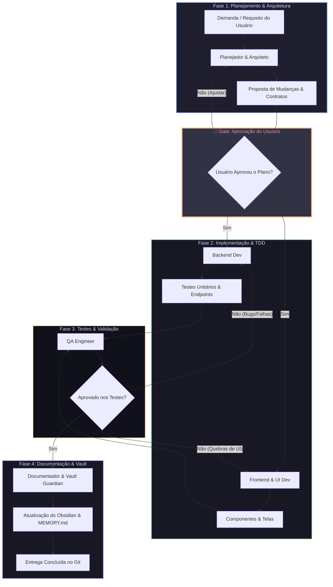

# 🤖 Orquestração de Agentes e Loop de Feedback

Este documento descreve o fluxo de execução em fases dos agentes do StreamDeck Mi9, incluindo o **Portão de Aprovação do Usuário (Human-in-the-Loop)** antes de qualquer implementação.

---

## 🔄 Fluxo de Execução com Gate de Aprovação

---

## 📋 Papéis e Responsabilidades por Fase

### 1. Fase 1: Planejamento e Arquitetura
- **Agentes:** 🧠 Planejador / Arquiteto de Software (`api-design`).
- **Momento:** Ativo no início da demanda.
- **Responsabilidade:** Análise de viabilidade, mapeamento de arquivos e elaboração do plano de mudanças detalhado.

### 🛑 Gate de Aprovação do Usuário (Human-in-the-Loop)
- **Momento:** Entre a Fase 1 e a Fase 2.
- **Regra Estrita:** NENHUMA linha de código de produção é alterada antes de o usuário revisar o plano e responder com aprovação explícita.

### 2. Fase 2: Implementação Técnica & TDD
- **Agentes:** 💻 Backend Dev (`tdd-workflow`) e 🎨 Frontend / UI Designer.
- **Momento:** Disparados somente após aprovação do plano pelo usuário.
- **Responsabilidade:** Escrita de código-fonte modular (`backend/`, `frontend/`) e testes automatizados.

### 3. Fase 3: Validação e Qualidade (QA)
- **Agentes:** 🧪 QA Engineer & Tester (`security-review`).
- **Momento:** Acionado após a conclusão da implementação.
- **Responsabilidade:** Execução de linters, testes e auditoria de segurança. Falhas retornam em loop para o Dev.

### 4. Fase 4: Documentação e Acervo
- **Agentes:** 📝 Documentador & Vault Guardian.
- **Momento:** Acionado após aprovação pelo QA. Atualiza o Obsidian, `MEMORY.md` e sincroniza com o Git.
