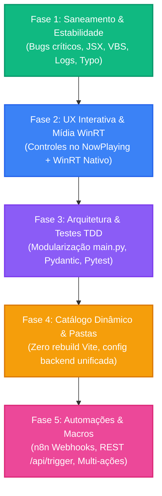

# 🚀 Master Roadmap & Planejamento Estratégico (V9 a V12)

Este documento consolida o planejamento oficial de evolução do **Stream Deck Mobile (Xiaomi Mi 9)**, estruturado em 5 fases de alto impacto com foco em estabilidade, ergonomia móvel e automações inteligentes.

---

## 🧭 Visão Geral do Pipeline de Evolução

---

## 🛠️ Detalhamento das 5 Fases

### ✅ Fase 1: Saneamento, Estabilidade & Bug Fixes (Concluída)
- [x] **Correção de JSX no Header:** Eliminação de handlers `onClick` duplicados em botões de tema e configurações no `Header.jsx`.
- [x] **Portabilidade dos Scripts VBS:** `iniciar_streamdeck.vbs` e `iniciar_backend_oculto.vbs` atualizados para obter diretórios dinamicamente via FSO e executar instância única.
- [x] **Correção de Typo no `requirements.txt`:** Correção do pacote `winrt-Windows.Storage.Streams` e inclusão de `psutil`, `pytest`, `pytest-asyncio` e `httpx`.
- [x] **Rotação de Logs com `RotatingFileHandler`:** Substituição de FileHandler infinito por rotação de 5MB (3 backups) e limpeza do log inflado de 29MB.
- [x] **Resiliência do CheckUP:** Mapeamento dinâmico relativo do executável do CheckUP Windows no `apps_config.py`.
- [x] **Limpeza do Linter Frontend:** Resolução de advertências do `oxlint` e compilação limpa do Vite PWA.

---

### 🎵 Fase 2: UX Mobile & Controles de Mídia
- [x] **Design Visual Preservado:** Card `NowPlaying` mantido visual, limpo e imersivo com OLED True Black e glow dinâmico.
- [x] **Controle Nativo de Mídia via WinRT:** Comandos de mídia (`sys_media_playpause`, `sys_media_next`, `sys_media_prev`) migrados para chamadas nativas assíncronas do WinRT SMTC no `media_service.py` com fallback para teclas virtuais.

---

### 🏗️ Fase 3: Arquitetura Backend, Tipagem Pydantic & TDD (Concluída)
- [x] **Desacoplamento do `main.py`:** Módulos especializados `services/agent_service.py` e `services/telemetry_service.py` extraídos. `main.py` enxuto (< 100 linhas).
- [x] **Contratos e Validação Pydantic:** Schemas `AuthPayload` e `DeckActionPayload` no `schemas/deck_schemas.py` com validação no `deck_router.py`.
- [x] **Suite de Testes Automatizados (Pytest):** 10 testes unitários e de integração cobrindo autenticação WebSocket, erro 1008, clamp de volume do CoreAudio e rotas HTTP (`10 passed em 0.92s`).

---

### 📱 Fase 4: Catálogo Dinâmico & Configuração Unificada (Concluída)
- [x] **Catálogo Unificado no Backend:** Arquivo `deck_catalog.json` servido via API (`GET /api/v1/deck/catalog`) e enviado no handshake WebSocket.
- [x] **Carregamento Dinâmico no Frontend:** O PWA consome o catálogo e renderiza dinamicamente N páginas no `DeckSwiper.jsx` (zero necessidade de recompilar com Vite para alterar apps).
- [x] **Registro Dinâmico de Ícones:** Módulo `iconRegistry.js` mapeando SVGs locais e componentes Lucide de fallback com renderização otimizada.
- [x] **Persistência Atômica & Sincronização em Tempo Real:** Rota `PUT /api/v1/deck/catalog` com persistência atômica e broadcast imediato (`catalog_updated`) para todos os celulares.

---

### 🤖 Fase 5: Automações Externas, n8n & Macros (Concluída)
- [x] **Endpoint REST para Gatilhos Externos (`POST /api/trigger`):** Protegido por Bearer Token no cabeçalho `Authorization: Bearer <TOKEN>`, executando apps, volume, mute de microfone e macros.
- [x] **Despacho de Webhooks pelo Stream Deck:** Ação `call_webhook` via WebSocket e REST despachando chamadas assíncronas com `httpx` para o n8n.
- [x] **Sistema de Macros (Multi-Ações):** Motor assíncrono em `macro_service.py` executando sequências de passos (`study_mode`, `gaming_mode`) configuradas em `macros_config.json`.
- [x] **Suite de Testes com Pytest:** 19 testes automatizados com 100% de aprovação (`19 passed em 2.40s`).

---

[[Histórico de Entregas]]
[[Features]]
[[MAIN]]
